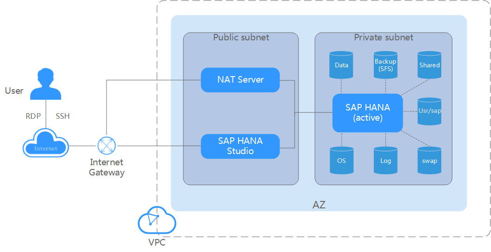
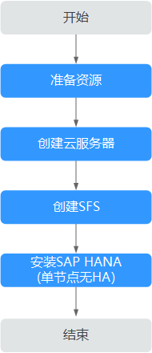

# 单节点部署（无HA）

单节点部署无HA（High Available）的方案，如[图1](#fig162657301243)所示。

**图 1**  单节点部署（无HA）方案  

说明如下：

-   VPC网络：为了保证网络的安全，SAP HANA系统中所有节点在一个VPC网络内，且所有节点应属于同一个AZ（Available Zone）。
-   公网子网区：
    -   NAT（Network Address Translation）服务器：租户对SAP HANA节点的SSH访问需要通过NAT服务器跳转。
    -   SAP HANA Studio服务器。运行SAP HANA Studio软件。租户通过RDP（Remote Desktop Protocol）或SSH协议访问该服务器，对SAP HANA系统进行管理。

-   私有子网区：

    SAP HANA节点：用于部署SAP HANA软件。服务器上共有以下磁盘，其中：

    -   OS盘：操作系统安装目录。
    -   Data卷：用于定时存储SAP HANA内存数据库传过来的数据。SAP HANA的内存数据库（即高性能内存中运行的数据库）会定时（缺省为5分钟）将数据库中的内容写入Data卷。
    -   Log卷：用于在事件触发的时候存储数据。服务器的内存数据库中完成一次事件触发（例如完成一条或一批记录的刷新），会将数据库中最新的内容写入Log卷。
    -   Shared卷：主要用于存放SAP HANA的安装软件，以及SAP HANA数据库的运行日志文件等。
    -   Backup卷：用于存放SAP HANA数据库的备份文件。
    -   usr/sap卷：用于挂载“/usr/sap“目录。
    -   swap卷：Linux交换空间。

部署流程如[图2](#fig1288915191213)。

**图 2**  单节点部署（无HA）流程  

