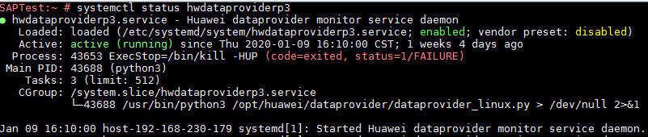

# 安装Data Provider软件

需在所有云服务器上安装Data Provider软件，SAP技术支持人员通过该软件收集云服务器所在的平台信息，以便在SAP系统故障、性能下降时进行定位和分析。

> **说明：**   
>SAP NetWeaver所在的服务器上，在创建服务器的时候需要为其指定名为“DataproviderAccess“的Agency，同时也需要安装Data Provider软件。  

## 操作步骤

1.  登录所有云服务器。
2.  执行以下命令，在云服务器上检查是否已安装Data Provider软件。

    **systemctl status hwdataproviderp3**

    执行命令后，查看状态类似下图所示，“Active”为active（Running），表示已安装Data Provider软件，否则请参考[《Data Provider for SAP用户指南》](https://support.huaweicloud.com/dpug-sap/sap_01_0001.html)，安装Data Provider软件。

    

