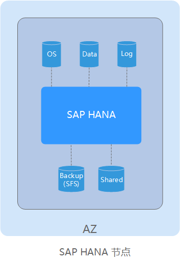

# 节点和角色

SAP HANA系统是由一个或多个SAP HANA节点组成的。

## SAP HANA节点

SAP HANA节点是构成SAP HANA系统的逻辑单元，一个SAP HANA节点包括了指定规格的CPU、内存和存储（如Log卷、Data卷和Shared卷、Backup卷），如[图1](#fig25600693102822)所示。

**图 1**  SAP HANA节点  

## SAP HANA Studio

SAP HANA Studio提供对SAP HANA系统的管理和监控、信息建模。也提供访问用户数据的能力，即作为Client的能力。包括信息有：通用系统信息（如软件版本）、 告警信息（由Statistics Server产生）、 重要系统资源统计视图等。

## NAT Server

提供SSH访问跳转的功能。租户对SAP HANA节点的SSH访问需要通过NAT服务器跳转。

## SFS

弹性文件服务（Scalable File Service）提供文件共享功能。创建SFS用于Backup卷，提供共享路径给SAP HANA节点。

## SAP HANA角色

在SAP HANA集群部署中，SAP HANA节点上存在的角色如[图2](#fig43239806104111)所示。

**图 2**  SAP HANA节点的角色  

每个SAP HANA节点上都有Name Server和Index Server进程。进程的角色如[表1](#table1938195995248)所示。

**表 1**  SAP HANA角色说明

<table><thead align="left"><tr id="row6505585095248"><th class="cellrowborder" valign="top" width="17.919999999999998%" id="mcps1.2.4.1.1">
进程

</th>
<th class="cellrowborder" valign="top" width="18.86%" id="mcps1.2.4.1.2">
种类

</th>
<th class="cellrowborder" valign="top" width="63.22%" id="mcps1.2.4.1.3">
说明

</th>
</tr>
</thead>
<tbody><tr id="row5037496995248"><td class="cellrowborder" rowspan="2" valign="top" width="17.919999999999998%" headers="mcps1.2.4.1.1 ">
NameServer

</td>
<td class="cellrowborder" valign="top" width="18.86%" headers="mcps1.2.4.1.2 ">
Configured Role

</td>
<td class="cellrowborder" valign="top" width="63.22%" headers="mcps1.2.4.1.3 ">
初始配置角色。

<ul id="ul986796710921"><li>MASTER：MASTER作为全局事务协调器，提供全局事务协调的功能，并保存计算节点集群信息的全局元数据。在一个集群中，初始配置了三个MASTER，但实际上，只有一个激活。</li><li>SLAVE：缓存需要的元数据，采用分布式架构，承担由主节点分配来的任务，执行对应的数据库操作。一个集群内有多个从节点。</li></ul>
</td>
</tr>
<tr id="row3800114010458"><td class="cellrowborder" valign="top" headers="mcps1.2.4.1.1 ">
Actual Role

</td>
<td class="cellrowborder" valign="top" headers="mcps1.2.4.1.2 ">
运行过程中，因为选举机制，导致当前实际激活的角色。

<ul id="ul5181579114521"><li>MASTER：从配置为MASTER的节点中选举出来的主节点。</li><li>SLAVE：除MASTER之外的其他节点。</li></ul>
</td>
</tr>
<tr id="row2408362895248"><td class="cellrowborder" rowspan="2" valign="top" width="17.919999999999998%" headers="mcps1.2.4.1.1 ">
IndexServer

</td>
<td class="cellrowborder" valign="top" width="18.86%" headers="mcps1.2.4.1.2 ">
Configured Role

</td>
<td class="cellrowborder" valign="top" width="63.22%" headers="mcps1.2.4.1.3 ">
初始配置角色。

<ul id="ul12637773101039"><li>WORKER：实际运行，并执行数据库业务操作的节点。</li><li>STANDBY：切换时接管故障节点。一个集群可以有零到多个，默认设置一个STANDBY节点。正常情况下此节点的软件是运行的，只不过其内存数据库中没有数据，不能执行业务处理。切换的过程是自动进行的。</li></ul>
</td>
</tr>
<tr id="row655799191053"><td class="cellrowborder" valign="top" headers="mcps1.2.4.1.1 ">
Actual Role

</td>
<td class="cellrowborder" valign="top" headers="mcps1.2.4.1.2 ">
运行过程中，因为选举机制，导致当前实际运行的角色。

<ul id="ul3096113101121"><li>MASTER：从WORKER节点中选举出来的主节点。该主节点与Name Server中实际的主节点为同一节点。</li><li>SLAVE：WORKER节点中除了主节点之外的其他节点，将变成SLAVE节点。</li><li>STANDBY：含义同Index Server的“Config Role”描述。实际运行的时候，可能由于多次倒换的结果，任何一个节点都有可能成为STANDBY节点。</li></ul>
</td>
</tr>
</tbody>
</table>

