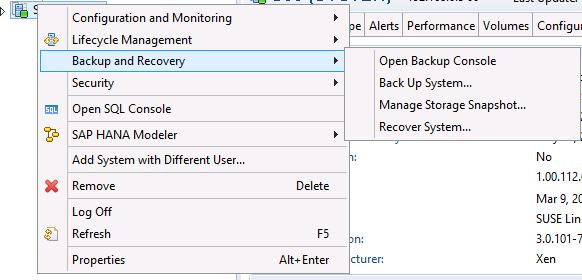
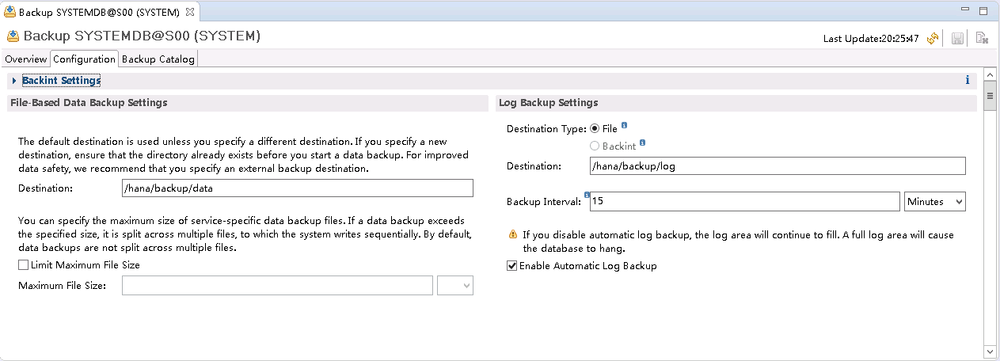
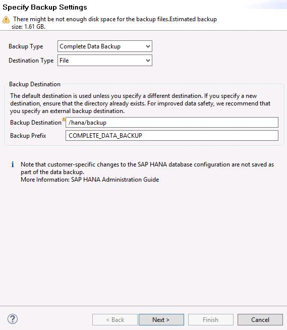

# 配置备份路径

配置SAP HANA数据备份的路径，满足备份的要求。此处以使用SAP  HANA 1.0时在Windows上安装的SAP HANA Studio上的操作为例介绍操作。

## 操作步骤

1.  在Studio所在的云服务器操作系统上，单击“开始  \>  SAP HANA  \>  SAP HANA Studio“，并打开SAP HANA Studio软件。
2.  在左侧“System“区域中，右键单击数据库节点，并选择“Backup and Recovery  \>  Open Backup Console“，如[图1](#fig5545122222451)所示。

    **图 1**  Open Backup Console菜单项  
    

3.  在右侧界面上，单击“Configuration“页签，并配置备份路径，如[图2](#fig32768109222451)所示。

    > **说明：**   
    >备份路径为“/hana/backup/data“和“/hana/backup/log“。  

    完成后，单击右上角的保存图标保存配置。

    **图 2**  配置备份路径  
    

4.  在左侧“System“区域中，右键单击数据库节点，并选择“Backup and Recovery  \>  Back Up System...“，弹出备份设置界面，如[图3](#fig30580092222451)所示。

    **图 3**  备份设置界面  
    

5.  使用默认配置，单击“Next“，进入“Review Backup Settings“界面。确认内容无误后，单击“Finish“。系统开始执行备份任务。

    > **说明：**   
    >SAP要求，SAP HANA系统安装完成后，应马上执行一次数据备份。  
    >使用SAP HANA 1.0需要备份主备节点数据库，使用SAP HANA 2.0需要备份系统DB和租户DB。  

6.  完成备份任务后，系统提示备份任务结束，单击“Close“，关闭界面。

